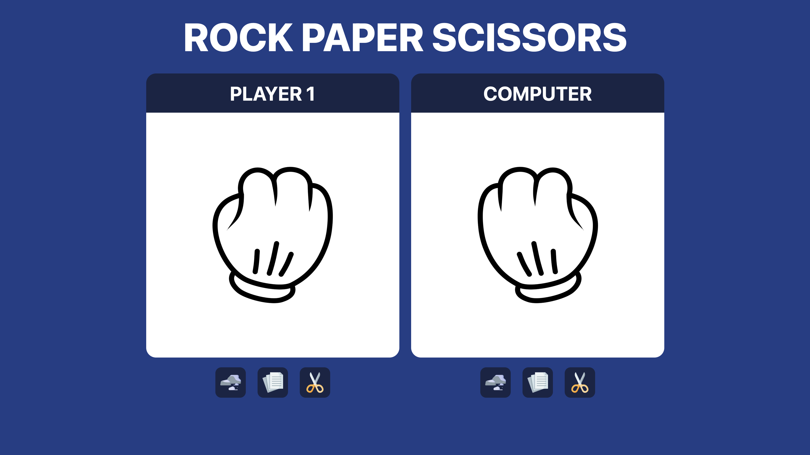
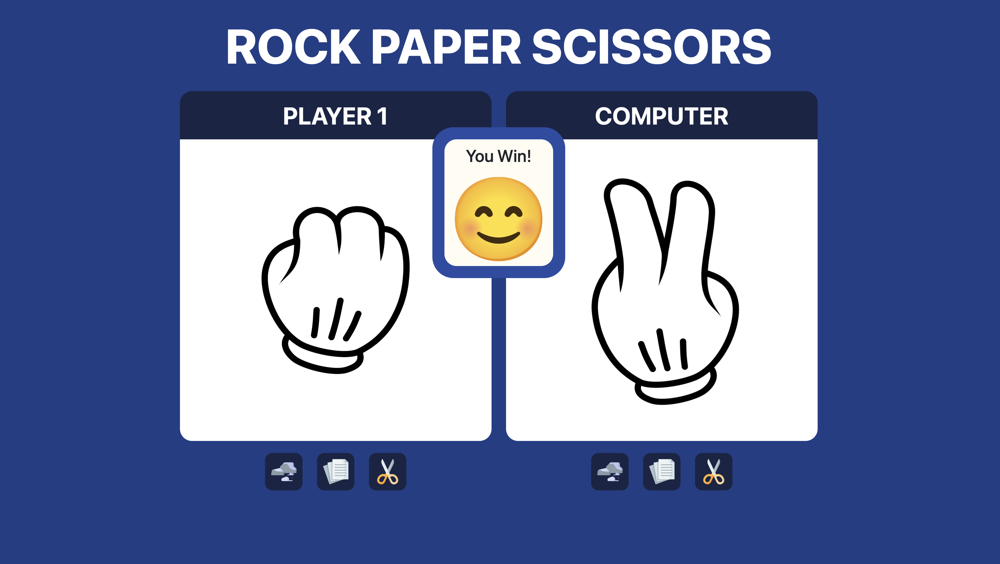
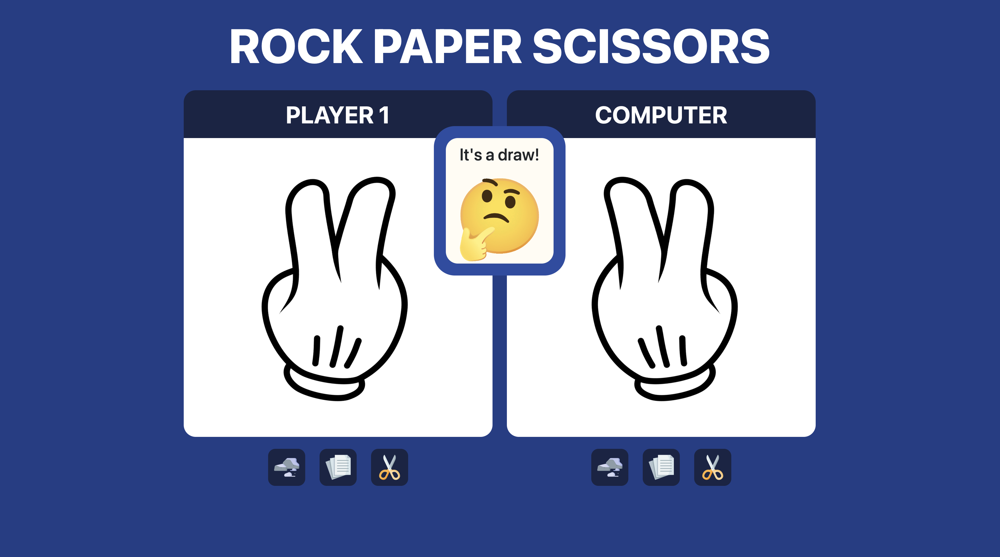
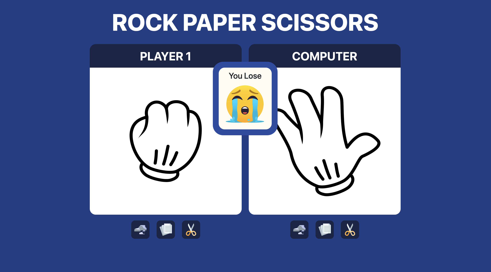

# JS-rock-paper-scissors
A Simple JS game Rock Paper Scissors   

<h2><strong>THE GAME:</strong></h2>
The rules of the game are the same of the old game rock, paper, scissors: 
<ul>
<li>Rock beats scissors</li>
<li>Paper beats Rock</li>
<li>Scissors beats Paper</li>
</ul>
To play the game you must push one of the three button. The first button is rock, the second button is paper and the third button is scissors.  
The computer will give a random answer to your choice and will appear a message that will tell if you won, lost or draw.  

  
<h3><strong>Have fun!</strong></h3>
